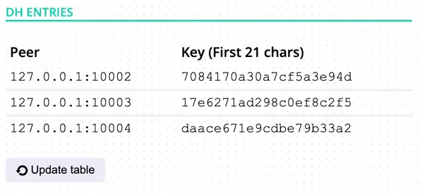
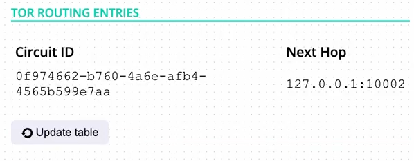
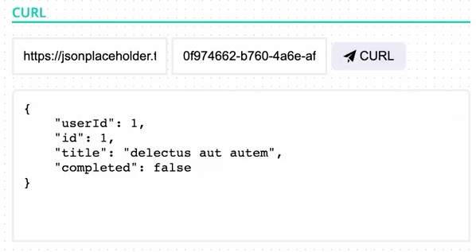

# Peerstor - Adding an encrypted and anonymous overlay network to Peerster

TLDR: Peerstor adds authenticity, message integrity, and confidentiality to Peerster by implenting a simplified version of TLS and the [Tor](https://www.torproject.org/) onion routing protocol.


Provided by the DEDIS lab at EPFL.

## Run the tests

To run all our added tests, run `make test_tor`.

## Run it

### Pre-requisites
Install go >= 1.19.

### Setup the Node
Run 4 nodes by opening 4 terminals and running the following commands in each:

```sh
cd gui
go run mod.go start
```

### Connect to a peer's proxy
Then open the web GUI page `gui/web/index.html` and enter the peer's proxy
address provided by the peer's log: `proxy server is ready to handle requests at
'127.0.0.1:xxxx'` for every peer/node. 

### Setting up the network
Now you need to set up the routing table. Add to node1 the address of node2, to node2 the address of node3, and to node3 the address of node4. Then send a broadcast message from node1. You should see the message being received by node2, node3, and node4 and all nodes should upload their routing table. You will notice a lot of messages being sent between nodes, this is because of the nodes discover each other and perform Diffie-Hellman-Key-Exchange to setup a TLS connection. Go to the section "Tor" and click below "DH Entries" on "Update Table". Now you should see for every node a part of the exchanged symmetric key. 

### Create a circuit
Now you can create a circuit. Go to the section "Tor" and select a exit node and add it in the input "finalDestination" and select the amount of nodes for your circuit. We followed the Tor default by using 3 nodes. And now click on "Create Circuit". You should see a new circuit being created. You can also click on "Update Table" in "Tor Routing Entries" to see the circuit being added to the Tor routing table.

### Using the circuit
Cool! You can use the circuit now by adding URL and the circuit you want to use for your request. After you added it you can click on "CURL" and you should see the response of the request. This version just support small requests. So please be aware of that. We used for the demo the following [website](https://jsonplaceholder.typicode.com/todos/1).

### Follow the circuit
You can follow the circuit by just updating Tor Routing Entries for every node and by just following the table. You will see that the circuit is created and that the messages are routed through the circuit.

## Screenshots

1. DH entries



2. Tor routing entries



3. Using the circuit



4. Follow the circuit
